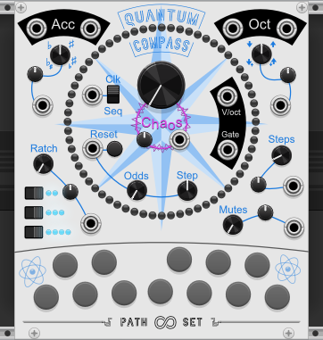
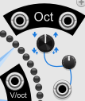
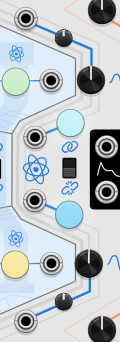
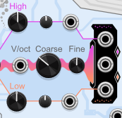
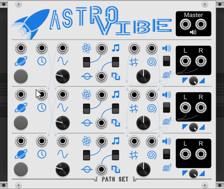

# Manual for PathSet Modules

## Orchestrator 

Plugin: [PathSet - Infinity](https://library.vcvrack.com/PathSet-Infinity)  
Examples: [Orchestrator](Examples.md#orchestrator) 

Orchestrator is a modulation and gate source designed to be the conductor of a repeatable modular song. The Module is divided into a central head and eight arms. The head controls the overall length of the song. It also "moves" each arm creating macro oscillations or movements in the overall song. Each arm then takes that macro oscillation and either adds micro oscillation to form a modulation output or uses it turn on and off a gate sequence.

Bypass: Does nothing.

### Head

The knobs that are the eyes of Orchestrator are`Sequence Complexity` and `Sequence Length`.  The right one,`Sequence Length` controls how often *all outputs* of Orchestrator repeat. Note that if Orchestrator is running at 10x or 100x speed from the contextual menu, the sequence length is also scaled accordingly. `Sequence Complexity` controls how fast the arms of the Orchestrator move during the song. This in turn affects how much the song changes. The position of each arm is shown through the eight sequence lights. Note that while you are turning `Sequence Complexity` the song's position will move creating more movement temporarily. 

The mouth of Orchestrator contains the `New Head Trigger` and `New Head Button`. Either will change the internal signature/pattern of the macro oscillations. Once you change it though, there is no way to go back. 

 

Above Orchestrator's head are several more controls related to the overall song. To the upper left there is `Run Mode` which can be set to repeat or one-shot. As well as `Run Input` and `Run` button/light which control weather the song is playing. The input and button generally toggles the current running state. The one exception is in one-shot mode, the run input always turns the running state on and can never turn it off. To  the upper right of the head are a `Reset` input and a `End of Cycle` output. `Reset` brings the song back to the start but does not change the running state. `End of Cycle` is high for one sample when the song ends.
 
Tip: Patch the `EOC` to `New Head Trigger` to get a never ending song.

### Arms

Each of the eight arms on Orchestrator have three outputs each along with several configuration options:

 
Starting from the body working out there is the `New Sequene` input and button. Either will change the internal signature/pattern of that arm. See [Modulation mode](#Modulation-Mode) or [Drum mode](#Drum-Mode) for specifics.

 
Next is the `Arm Mode` switch. This toggles between [modulation mode](#Modulation-Mode) and [drum mode](#Drum-Mode). Both are described in more detail bellow.

 
Next is `Arm Length` and `Arm Rate`.  These control how fast each arm's internal sequence/pattern plays and how often it repeats. These knobs are independent form the knobs on the head. Note that while you are turning `Arm Rate` the song's position will move creating more movement temporarily.

 
Finally we have the three outputs pre arm along with individual `Power` and `Offset` knobs per output. Note the positioning of these knobs above or bellow each arm alternates. The following sections describe how they affect behavior depending on the arm's mode.

### Modulation Mode
In Modulation Mode the arm's internal sequence is an LFO waveform that creates micro oscillations that are added to the arm's position. This is intended to control color and tambour CVs on voices. In doing so micro oscillations create variety in the moment and the macro oscillations create movement across the song.

In modulation mode all three outputs use the same micro oscillation waveform, but the `A Outputs` (closer to the head) run at quarter speed and the `C Outputs` (further from the head) run at 4x speed.

In modulation mode `Power` knob attenuates the micro oscillation. So if you turn it all the way down you get just the arm's position out. `Offset` is a DC offset shifting the voltage range of the modulation output.

### Drum Mode
In drum mode the arm's internal sequence creates a drum pattern. These are intended to drive the trigger on any and every voice in the song. In this mode the macro oscillation only turns the gates on or off but does not modify their pattern. This allows for each pattern to be more easily identifiable to the listener when it is active.

In drum mode all each output has its own internal sequence. Additionally the `A Outputs` (closer to the head) require a lower threshold form the macro oscillator to turn on making them more suitable for base instruments. Where as the `C Outputs` (further from the head) require a higher threshold making them more suitable for accent sounds.

In drum mode `Power` knob controls how many drum hits there are. As you turn this down fewer and fewer hits in the underlying sequence make it through. The `Offset` knob controls the swing of the drum hits. At 12-oclock (0%) the sequence has no swing.

### Contextual Menu
The contextual menu for Orchestrator offers the ability to speed up the overall song as well as `Wave Arms` which quickly tests the extreme range of the modulation.

The `Speed` setting has 1x, 10x, and 100x. This speeds everything up in the module. You can use this to quickly display the outputs to a scope. Or can use this to just create really repetitive sequences, or combine it with one-shot mode to create a bizarre envelope generator.

The `Wave Arms` ignores the main signature/pattern of the macro oscillator, and instead each arm quickly waves up and down out of phase. This is intended to allow you to quickly hear the full range of the modulation and tweak the power, offset, and any other attenuators involved. However you feel free to just use this mode in general. In this mode the `Sequence Complexity` knob controls the rate at which the arms wave.

## Quantum Compass

Plugin: [PathSet - Infinity](https://library.vcvrack.com/PathSet-Infinity) 
Examples: [QuantumCompass ](Examples.md#quantum-compass ) 

Quantum Compass is a sequencer where instead of controlling each step, you instead turn on certain notes and it decides when to play each note. For a quick-start guide, connect an external clock to the `Clock or Position` input. Then select two or more notes from the keyboard buttons at the bottom of the module. You will see the central ring of LEDs light up showing you sequence generated. You can hook up your voice to the `1V/octave` and `Main Gate` outputs. Feel free to add more notes or **hold down a note to remove it**.

The rest of the knobs affect the sequence that comes out of the compass. The compass's central LED display will change display based on which knobs you turn. You can also switch the display mode from the contextual menu.

Bypass: Does nothing.

### Steps 

The `Max Steps Count`, `Steps Attenuveter` and `Steps CV` all control how many steps are in the sequence. Anywhere between 1 and 64 steps are supported. Increasing or decreasing the step count does not change the underlying pattern of notes, it only truncates it.

### Ratchets

Turning up the `Ratchet` knob adds ratcheting to some steps in the sequence. Ratcheted steps can play 2, 3 or 4 times in a single clock cycle. The switches bellow the ratchet know control which of these options are available.  Ratchet also has an attenuveter and CV input. Note that ratcheting pulls from the next 3 notes in the sequence creating more melodic interest. Note that with the `Chaos` knob set to 0 the ratcheting effect is consistent each time the pattern repeats.

### Mutes

Turning up the `Mutes` knob adds silence to some steps in the sequence. The `Mutes` knob also has a attenuverter and CV input. 

### (Auto) Reset

Inside the compass are a `Reset` button and `Reset Trigger` input. Either of these return the sequencer to the start. There are also an `Reset Odds` knob. Turning this up creates a chance that the sequencer will auto reset part way through its sequence. When turning this knob the compass will show a green light on the first step in the sequence and red lights where it has a chance to reset. The `Reset Step` knob controls which steps in the sequence have chance to reset.

### Accidentals & Octaves

 

The upper left and upper right of the compass have controls and outputs for Accidentals (Flats and Sharps) and Octave Shifts (up or down one octave). These two sections work very similarly. The main `Accidental` or `Octave Shift` knobs can be turned left or right to add steps to the sequence that will have their corresponding effect. As you turn the knob the compass will show you which steps have which effects. If you turn the knobs far in either direction you will get both types of events (Flats and sharps or up and down shifts). Both knobs also have attenuverters and CV inputs. All four events also have output gates at the top. These gates are high the whole clock cycle that they are in effect.

### Chaos

After you've got a fun sequence dialed in you can use the central `Chaos` knob on the Quantum Compass add some randomness to break up the monotony. The compass display will show the effect of the Chaos on whatever other knob you last turned (or you can change the display from the contextual menu). Generally speaking the chaos knob adds more of whatever settings you have dialed in. Though if you turn the chaos knob up too far you'll soon see things become a blur. 

The chaos knob affects Accidentals, Octave Shifts, Ratchets and Mutes. It does not affect the notes entered, the sequence length, or the auto reset.

The `Chaos` knob also has a attenuverter and CV input. Enjoy :)

### Sequence Mode

If all the above wasn't enough, the Quantum Compass has one more twist. Next to the clock input is a switch labeled `Clk` and `Seq` labeled `Position Control`. In the default clock position the clock input expects a trigger/gate and advanced a sequence every time a trigger/gate is received. In the sequence mode that input expects a control voltage. That control voltage directly selects which step the Quantum Compass is playing. When the value changes enough to select a new position a `Gate` is generated. Hook this up to an LFO to create your own or a sample and hold to get even more variation out of the Quantum Compass.

## Warp Drive

Plugin: [PathSet - Infinity](https://library.vcvrack.com/PathSet-Infinity) 
Examples: [WarpDrive](Examples.md#warp-drive) 

Warp Drive is a massive two-engine starship. Each engine is a voice with its own LFO and envelope. Each engine's voice consists of three audio oscillators, called coils. The main coil is piped through it's envelope and is frequency modulated by the high and low coils.

Each part of Warp Drive has its own internal signature that controls the shape and pattern of the waveform used. Signatures can be randomized using buttons or triggers.

When initialized the two engines are independent of each other but there are several settings down the middle that can couple the engines in various ways.

Bypass: Does nothing.

### LFO & Clock

The left of the panel has the LFO section. The LFO has an internal `signature` that can be randomized through a button or a trigger. The LFO also has a `rate` that controls the overall rate at which the LFO plays.

The LFO signal is also used to generate a chaotic clock signal. Both the LFO and clock signals are available as outputs on the left of the module.

The `LFO/Clock Coupling` switch controls which engine's clock signals are routed up to envelope generators. The switch has three modes:
* **Duo** - Each engine's envelope is clocked independently by each engine's clock. 
* **Sync** - Only the left clock is used and is sent to both envelopes.
* **+Mod** - The left clock is used by both envelopes but the right LFO modulates the left LFO's rate.  

### Envelope

The right of the panel has the Envelope section connected with blue lines. The Envelope has an internal `signature` that can be randomized through a button or a trigger. The envelope also has a `rate` that controls how fast the envelope develops. 

Each envelope is triggered by an independent `clock input` that normalized to the clocks from the engine section of the Warp Drive.

The `envelope coupling` switch links the right envelope's signature to the left envelope. When the envelopes are linked they share the same wave form, but can have independent rates and triggers.

### Gravitation

The right of the panel has the `gravitation` section in orange. Gravitation affects the shape of the of all wave forms on that side of the ship. This includes the three audio coils, the LFO and the envelope. 

### Coils

The heart of the sound of Warp Drive comes from `Main Coil` of each engine. Each main coil which is controlled by a `V/oct` input as well as`Coarse` and `Fine` knobs. The main coil has a `signature` button and trigger. There is also an `engine coupling` switch which connects the left and right engine's main coil signatures.

The main coils can also be frequency modulated by the `high coil` and `low coil`. This modulation can be controlled through the `high coil power` and `low coil power` knobs in each engine. When the power knobs are at 0 (12 o'clock) they provide no modulation. Turning the knob to the left runs the high coil at 2x the speed and the low coil at 1/2 the speed. Turning the knobs to the right runs the high coil at 4x the speed and the low coil at 1/4th the speed. The further the knobs are turned way from 0 the stronger the frequency modulation is.

Note that the low and high coils have their own signatures that can be linked to the main coil or unlinked. Unlinking coils can create very crunchy sounds.

### Coil Attachment

The `Coil Attachment` knobs affect how the high and low coil signals are combined before modulating the main coil. When the attachment knob is at 0.5 (12 o'clock) the two side coils are added together, but the dial sweeps between 6 other forms of combination.

### Alignment and Mixture

The `Alignment` knob can add modulation to the high and low coil's power. By default when alignment is at 0 (12 o'clock) no modulation is added. Turning the `Alignment` knob to the right adds modulation from LFO and/or Envelope from that side of the engine. Turning the `Alignment` knob to the left adds it from the *other* engine's LFO and/or Envelope.

The `Mixture` knob controls whether the Envelope or the LFO is used for that modulation. All the way to the left only the LFO is used. All the way to the right only the envelope is used. In the middle a combination of the two are used and different combination is used for the high coil power vs the low coil power.

## Astro Vibe

Plugin: [PathSet (Free)](https://library.vcvrack.com/PathSet) 
Examples: [AstroVibe](Examples.md#astro-vibe)

Astro Vibe is three planetary obiters that can operate as VCOs or LFOs. Each orbiter has a wide range of controllable settings as well as internal planetary signature that affects the waveform. There are over three septillion planetary signatures and once you leave one your unlikely to ever find it again.

Bypass: Does nothing.

### Planet

Each orbiter generates a unique planetary signature when the module is created and when either the `New Planet Button or Trigger` is activated. The planetary signature affects the output waveform giving it a unique signature. For the Notes waveform mode each signature creates a unique sequence of between 2 and 22 different notes to play. In the crunchy waveform mode it affects the overall timbre of the sound. There are over three septillion signatures and no way to return to one once you leave. Signatures do persist when the patch is saved.

### Clock and Freq

Each orbiter has a `Clock` input which advances the notes in the Notes waveform mode. It does nothing in the Tones waveform mode. The clocks on the 2nd and 3rd orbiter are normalized to the previous orbiter, meaning you only have to connect a clock to the 1st orbiter to get all 3 going.

Each orbiter also has a `Frequency Knob` and `1V/Oct Input`. These two control the overall tone of the sound in the Audible mode and the overall speed of the LFO in the LFO mode. The 1V/Oct input is also normalized between the orbiters.

Note all internal routing can be disabled from the contextual menu.

### Engine and Waveform

The central switches control the `Engine` and `Waveform` of each Orbiter. Each switch is togglable to change the mode and also controllable with the corresponding input. If the input is high (above 5 volts) the toggle is inverted. If its low (bellow 0 volts) the toggle acts as normal. If the input is between 0 and 5 volts, the toggle flips back and forth and is proportionally one way or the other depending on what the input voltage is.

When the `Engine` mode is `Atomic` the sound more pure and smaller. When the mode is `Black Hole` the sound is buzzier and louder.

When the `Waveform` mode is on `Notes`the sound is melodic and plays a sequence with the clock. When on `Tones` the sound is always on and can be more crunchy. 

### Warping

The `Space Input`, `Spin Input` and `Warp Knob`all adjust the timbre of the sound as well as the panning between the left and right channels. The overall effect is more pronounced on the Tones waveform.

The Space and Spin Inputs are double normalized. If the previous orbiter is set to LFO mode, then the left and right channels are routed to the Space and Spin respectively. If not, then the previous orbiters space and spin inputs are carried forward. This internal routing can be disabled from the contextual menu.

### LFO vs Audio

Each orbiter has an `Speed` toggle that switches between an `Audible` mode and a `LFO` mode. In the Audible mode the output is also added to the master output at the top of the Module. In the LFO mode the output is normalized into the next orbiter's Space and Spin.

### Gain

Each orbiter has a `Gain` knob under its output. This gain is applied in both `Audible` and `LFO` mode. When the gain is turned to the left past the half way point the voltages are inverted.

## Ice Tray

Plugin: [PathSet (Free)](https://library.vcvrack.com/PathSet) 
Examples: [IceTray](Examples.md#ice-tray)

Ice Tray is a speed shifter and six tape delays, called ice cubes. Each cube can solidify, capturing what ever was last recorded into it for an indefinite amount of time.

Bypass: Left and Right inputs are connected directly to the outputs.

### Ice Cubes

The central section of the module displays the six `Ice Cubes`. The color of the large light indicates the`Solidity` of the ice cube:

* **Bright Blue** - Can be recorded to or played from
* **Dark Blue** - Can only be played from
* **Black** - Can't be accessed, but still remembers its last recording.

You can press the light to change its solidity. The large `Frozen Percent` knob also controls how likely a cube's solidity is to change over time. Crank it all the way up to 100% and the solidity won't change, unless you manually do so. 

The small light on the cube indicates which ice cube is being recorded (red) to and which is being played back (green). An ice cube can't be both at the same time.

Recordings on the cubes will persist when the patch is saved. The recordings can also be cleared through the `Clear Cubes` option in the contextual menu.

### Clocks

Ice Tray doesn't need any clocks to work but you can connect either or both of its clocks to signals to get more control over the rhythm of the output.

When the `Record Clock` is NOT connected, the`Record Length` knob sets the maximum number of seconds each cube is recorded too before switching to a new cube. When `Record Clock` IS connected, the recording cube will switch when the clock is received, or after 10 seconds. Note all times assume 44.1kHz.

Normally the playback cube will finish its recording before switching to a new cube, but you can end this early by sending a trigger to the `Playblack Clock`.

The `Playback Clock Resets Position` toggle controls where the playback starts on each cube. When on the playback starts at the start of each cube, but when off the position is not reset, so wherever the last cube ended the next cube starts.

### Speed Shift

The two large dials on the left control the speed at which the input signal is recorded. The pitch of the audio is corrected to maintain the original pitch regardless of playback speed. This can be CPU intensive and can be disabled from the contextual menu.

The `Numerator`  is divided by the `Denominator` to compute the final speed. Both the numerator and denominator can be modulated using the CV inputs and CV scalars. The modulated value is added to that on the large dial. The numerator and denominator are each rounded to the nearest whole number before computing the final speed.

### Patterns and Repeats

The `Repeat` knob controls how many times a single ice cube is repeated before another one is selected. If a CV is connected bellow the know then the knob scales that voltage.

The `Pattern` knob controls the order in which the ice cubes are are played back in. If the knob is turned to the left, the cubes are randomly skipped in increasing large steps leading to a random pattern each time. If the knob is turned to the order of the cubes is shuffled but consistent each time though with the caveat that cubes that are black, or being recorded to are skipped. 

### Feedback

The `Feedback` knob and corresponding CVs at the bottom of Ice Tray feed the output back into the recording cube. Unlike the input signal, the feedback signal is both speed up and pitch shifted by the speed controls. This gives the internal feedback a unique effect that an external source of feedback couldn't replicate.

## Shifty

Plugin: [Path Set (Free)](https://library.vcvrack.com/PathSet) 
Examples: [Shifty](Examples.md#shifty)

Shifty is a shift register for gates / triggers with controllable lookback / delay. Shifty lets you take a simple gate sequence and create seven varied gate outputs.

Shifty has a built in clock and clock divider. So unpatched you see that every second or so the the top blue light turn on and then shift down.

You can control the speed at which the lights shift with the `Clock Rate` knob or by patching in your own `Clock`. The `Clock Divider` or `Trigger` controls how often the top light turns on.

Connect to the seven `Output Gates` to tap into those delayed clock signals.

Bypass: All seven outputs are connected directly to the `Trigger`.

### Delay

By default Shifty is set up to delay each row by one beat / clock. This can be changed by adjusting the `Ramp` Knob at the top of Shifty. Turn `Ramp` all to way to the left and every row hits at once. Turn `Ramp` all the way to the right and it takes two beats for each row to hit.

Bellow the ramp knob are the `Delay CV inputs and knobs`. These add to the ramp value allowing you adjust the delay up or down for each row.  The `Delay` input is normalized to white noise allowing you to just use the knobs to add randomness. The noise ranges from 0 to 10 volts and at 10 volts the row is delayed an extra 16 beats.

Finally you can add stability to to the delays with the `Sample & Hold` knob. This knob controls how likely each row's total delay value is to be held, indicated by the red light in the row. Turning the knob all the way to the right effectively freezes the current delay pattern. Note the sample and hold chance is triggered every time the clock divider triggers, regardless of whether or not the trigger input is connected. The sample and hold values persist when the patch is saved.

### Echo and Mute

Between the shift register and the outputs are the `Echo` and `Mute` knobs. Use them to add more or less hits on each row. By default they don't do anything and you can see you can see the pink and orange lights match the blue light on the same row.

Turn the`Echo` knob up to add up to 3 extra hits to that row's gate. Each of the extra hits follow slightly different timings depending on how far the `Echo` knob is turned. This means there is a lot of variety of patterns you can get as you fine-tune the knob. The echo timing is also influenced by the incoming `Delay` value, allowing for more variety or stability depending on how the delay side is configured.

The `Mute` knob suppresses hits. If you have a frequent trigger or a lot of echos it can be helpful mute some of the hits. The mute knob pans through 693 different 24 beat patterns ranging from all beats passing to no beats passing. The mute pattern is further modified by the delay values so that you crank the clock divider all the way down to 1 you can still use the mute knob to get interesting and changing patterns.
