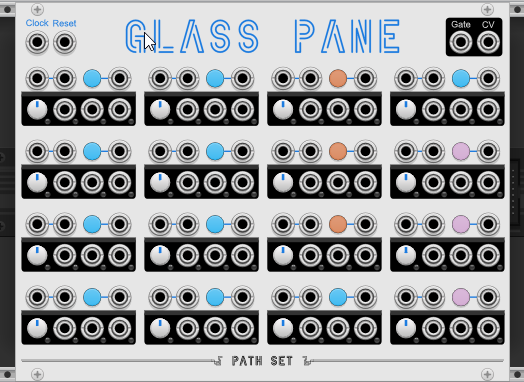
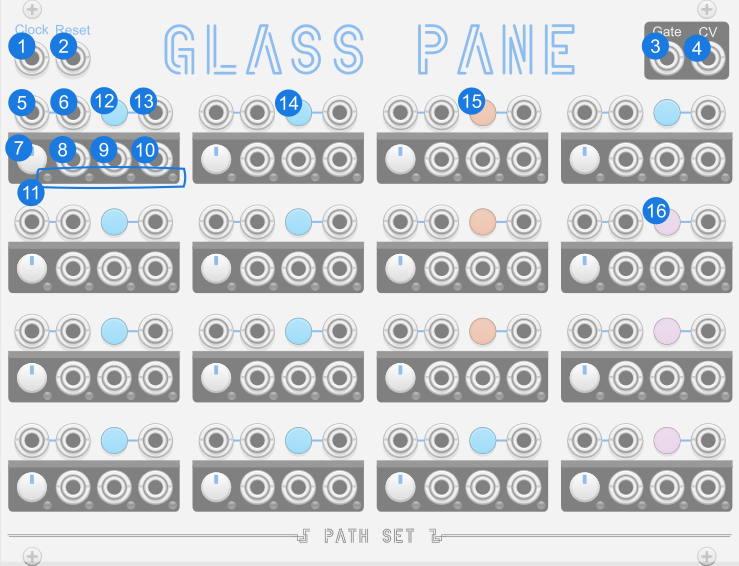
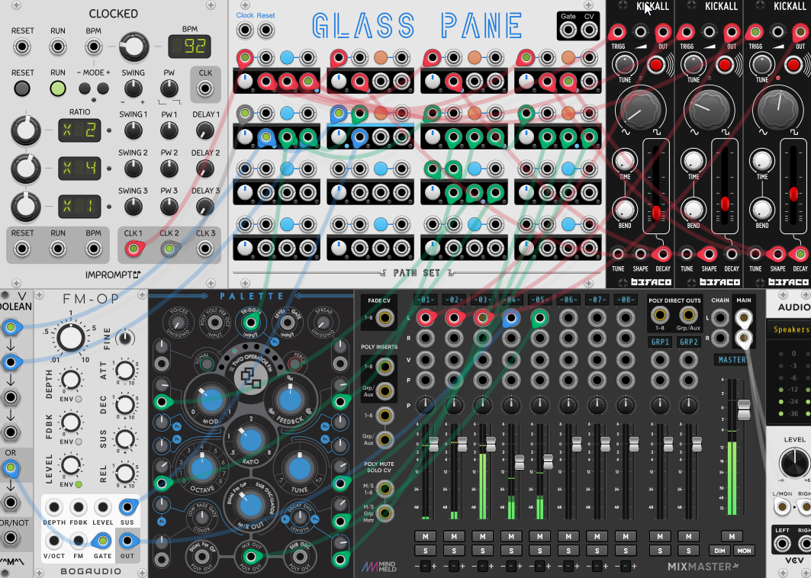

# Glass Pane

Glass Pane is a network sequencer where the patch cables control which step folows another. With it you can have randomness, branching, and even simple arpeggiation.

## Quick Start

This quick example shows off all three different modes. The sequence it generate has three parts that repeat.
1. The first part uses the blue Cycle mode to make a consistent four notes. You can see it in the first column connected with blue cables.
2. The seocnd part uses the orange Random mode to create variablity. You can see it inthe second column connected with orange cables.
3. The third part uses the purple Rachet mode to create a faster pattern.You can see it on third and 4th columns with the purple cables.

[Download Quick Start](../examples/GlassPane/GlassPane_QuickStart.vcvs?raw=true)

## Panel

1. **Clock Input** - Advances the sequencer to the next state depending on which ports are connected.
2. **Reset** - Resets the sequencer to the first state and resets all nodes to their last manually selected mode.
3. **Gate Output** - Gate signal to attach to a voice or evenlope generator.
4. **CV Output** - The CV value here matches the knob of the current state. 

**Per Node**
5. **Input X** - Trigger input. Connect to the output of another node or an external gate.
6. **Input Y** - Duplicate input to allow a second trigger.
7. **CV Knob** - Controls the CV value for this step. Range is configurable in contextual menue.
8. **Output A** - Output for this node. Connect to the input of another node or use as a gate.
9. **Output B** - Second output for this node. Less common/likely than Output A with `Weighted` odds or `Pryamid` pattern.
10. **Output C** - Third output. Even less common/likely.
11. **State Lights** - Shows the last event for this node.
12. **Mode Button & Light** - Controls which mode this node is in. Blue for Cycle, Orange for Random and Purple for Ratchet.
13. **Mode Trigger** - Trigger to cycle through modes. Connect to another node's output.

**Node Modes **
14. **Blue / Cycle** - Each input reliably cycles through the outputs of this node.
15. **Orange / Random** - Each input randomly selects an output of this node.
16. **Purple / Ratchet** - The outputs of this node are played in quick succession. The attached nodes are not recurisvely played like the other modes.

## Misc

### Contextual Menu

**Range** - Controls the voltage range of the CV knobs. Changing the range here does not update any knobs and so will change the all output values immediately.

**Cycle** - Controls how the Cycle mode works for all nodes. When `Evenly` is selected each output is visited an equal number of times. When `Weighted` the outputs of a node are more common on the left. So frequency is CV Knob > Output A > Output B > Output C.

**Odds** - Controls how the Random mode works for all nodes. When `Evenly` is selected each output is equaly likely to occur. When `Weighted` the outputs of a node are more likely on the left. So odds are CV Knob > Output A > Output B > Output C.

**Ratchet Speed** - Controls how fast the Ratchet mode plays. When set to `Whole Notes` the Ratchet speed is equal to the clock. `Half Notes` plays twice per clock etc. `Dynamic` plays a variable amount depending on how many outputs on a given node are connected.

## Features

### Basics

Create a sequence by connecting an output from the top-left node to one of the other nodes. Turn the CV knobs on each of the nodes to set their value. Connect a clock and you will have a two step sequence.

To expend a sequence connect the output of the last step to another unused node. You could repeat this to create up to a linear 16 step sequence, but where would the fun in that be? Instead, after creating a few linear steps, double back and create a branch by connecting a 2nd output from an existing node to another node. Now every time that node is visited one of its two outputs will trigger creating more complicated sequences.

Feel free to go hog-wild creating loop-backs, skips-aheads, or whatever else you can imagine. You can also start playing around with the different modes each node can have which are described below. You can also connect outputs from notes to the mode triggers to alow the network to modify itself.

### Cycle Mode

#### Cycle: Evenly

In cycle mode the node's output is consistent. By default the `Cycle: Evenly` context menu is selected. In this mode a nodes output play left to right then cycle back. So the first time it gets an input the nodes becomes active and its CV knob's value is sent to the CV out. The second time the node is active it's first connected output is sent a signal. So if all three outputs are connected, that is output A. If only ouput B and C are connected, then its ouput B. Subsequent inputs triger the remaining connected outputs from left to right. Once all outputs have been triggered the pattern restarts with the CV Knob.

#### Cycle: Weighted

If `Cycle: Weighted` is connected then the pattern becomes more complicated. It goes `K, A, K, B, K, A, K, C, K, A, K, B` (K stands for Knob). This weights the knob most heavily then A, then B, and finally C is the least likely. This Weighted mode is ment to create rarer events across the whole network. In weighted mode you can use ouput C to drive parts of the network you want to happen less often.

### Random Mode

In random mode the output of a node is random each time creating inconsisnte patterns. The contextual menu `Random: Even` and `Random: Weighted` control the odds of each outcome. Even gives all 4 outputs the same chance. In Weighted ouput C is the least likely to happen. Output B is twice as likely as C. Output A is three times as likely as C. And the Knob's CV value is six times as likely as Output C.

### Ratchet Mode

In ratchet mode does two things in combination. It shallowly visits each of the connected nodes and it speeds up the playing of those nodes. Shallow visiting a node means that the node is only going to be visited once and after that the active node will automatically return to the original anchoring ratch node. You can see this happen in the active light. When ratcheting the node that started a ratcehet remains partially lit.

The speed at which the ratcheting nodes are played can be controled by the `Rachet Speed` contextual menu. It has the following settings:
1. **Dynamic** - The number of connected ports on the node controls which speed is used. With non connected Whole Notes is used. Each connected port increases the speed one level.
2. **Whole Notes** - The speed matches the clock.
3. **Half Notes** - Twice the clock speed.
3. **Triplets** - Three times the clock speed.
4. **Quarter Notes** - Four times the clock speed.

The number of ratched notes is also set by the connected number of ports. The number will always be at least that of the connected number of output ports. The number will be larger if the current speed would leave a pause, instead extra ratches are added.

If a ratchet node is connected to another ratchet mode the second ratchet mode extends the length of the original node's ratcheting but the original ratchet note still remains the anchor node.

GlassPane uses the last full clock cycle recieved to compute how long ratcheting should be. So if the input clock is inconistent you may end up with some ratchets being fast and some being slow. If you don't like this effect, feed GlassPane a consistent clock.

### Loops and Dead Ends

Regardless of the mode, if a note does not have any outputs connected, subsquent triggers to it will revert back to the top-left node.

Sometimes you might notice GlassPane is stuck on a single node. This can happen if none has patch cables connected to its outputs, but none of them go to other nodes. Try adding a connection to another node, or back to the top-left node.

Other times you might find GlassPane is stuck in a small loop and isn't visiting anywhere else. In cases like this connect another output from one of the nodes that is being visited to the nodes you want to be visited.

### Bypass

When GlassPane is bypassed all outputs stay at 0V.

## Patch Examples

### Two Loops

[Download Example 1](../examples/GlassPane/GlassPane_Example1.vcvs?raw=true)

In this example ther left and right halfs of GlassPane are each their own 8 step loop. The left is blue cables and the right is orange cables. In the middle there are two random notes with extra purple cables bridging the two loops. Thee allow the playback to sometimes jump between the two loops, but only at that that specific point.

There are also two red connections, one in each loop. The one on the left skips ahead making the left loop shorter every other time through. The one on the right jumps back making the right loop repeat a section each time through.

### Drums Machine

[Download Example 2](../examples/GlassPane/GlassPane_Example2.vcvs?raw=true)

This example uses GlassPanel in a less typical way. Here instead of using the clock and CVs GlassPanel is just used as crude clock dividers and bernoulli gates.

In this patch the red cables connect one clock line to three Kickalls. The first node is a clock divider creating a 4 beat seqeuence where 3 of the beats each trigger one of the Kickalls. The other nodes on the first row are acting like bernoulli gates providing modulation to some of the kickall hits.

The red and blue cables drive the other two voices and FM-OP and Palette. Similar to the red cables, the first node is creating a sequence and the rest of the nodes are creating modulation.

This example also ilustrates that can have multiple input clocks driving different parts of GlassPane.

