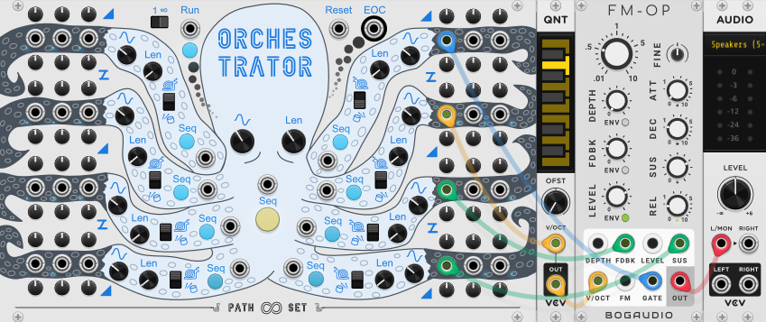
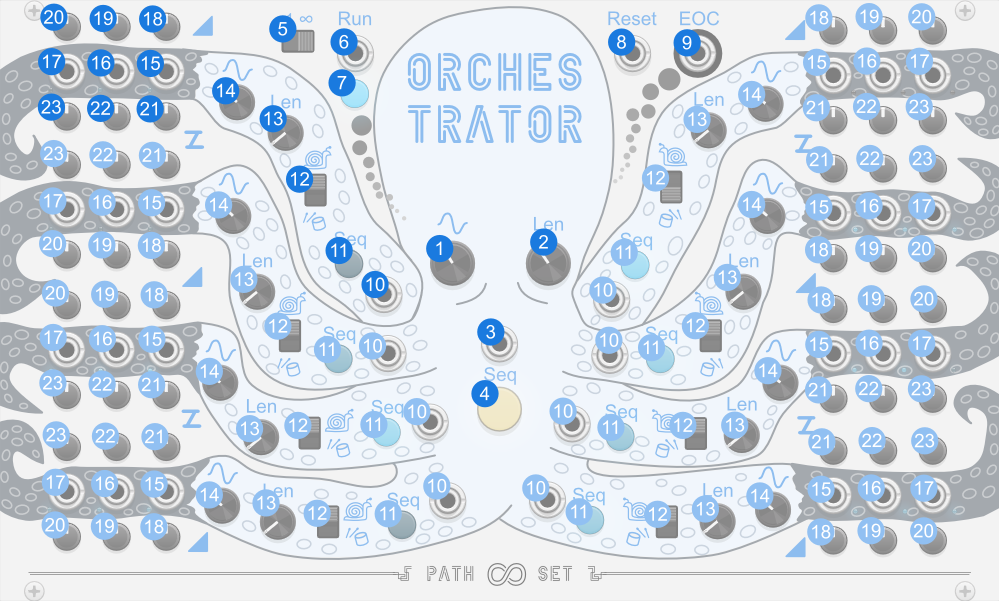
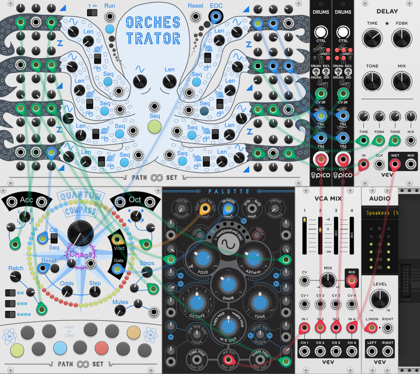

# Orchestrator 

Orchestrator is a modulation and gate source designed to be the conductor of a repeatable modular song. The Module is divided into a central head and eight arms. The head controls the overall length of the song. It also "moves" each arm creating macro oscillations or movements in the overall song. Each arm then takes that macro oscillation and either adds micro oscillation to form a modulation output or uses it turn on and off a gate sequence.

## Quick Start

[Download Quick Start](../examples/Orchestrator/Orchestrator_QuickStart.vcvs?raw=true)

1. Set one arm to Drum mode.
2. Connect that arm to the gate of a voice.
3. Connect another arm to a quantizer.
4. Connect the output of the quantizer to the V/Oct of your voice.
5. Connect a third arm to some modulation on your voice.

## Panel

1. **Sequence Complexity** - Controls how fast the overall pattern changes.
2. **Sequence Length** - Controls how fast the overall sequence repeats.
3. **New Head Sequence Input** - Creates a new pattern for the overall sequence.
4. **New Head Sequence Button** - Creates a new pattern for the overall sequence.
5. **Run Mode Switch** - Toggles if whole modules repeats or stops after one play through.
6. **Run Input** - Toggles if the whole module is running or not. In one-shot mode this won't do anything if already running.
7. **Run Button** - Toggles if the whole module is running.
8. **Reset Input** - Resets playback back to the start of the sequence.
9. **End of Cycle Output** - Is high for one sample when the sequence ends.
10. **New Sequence Input** - Creates a new pattern for that arm.
11. **New Sequence Button** - Creates a new pattern for that arm.
12. **Arm Mode** - Toggles if the arm is outputing modulation vs gates
13. **Arm Length** - Controls how fast the arm's pattern repeats.
14. **Arm Rate** - Controls the rate of the arm's pattern. 
15. **A Output** - Nearest modulation or gate output for that arm.
16. **B Output** - Middle modulation or gate output for that arm.
17. **C Output** - Furthest modulation or gate output for that arm.
18. **Power A** - Adjusts the intensity of the near output on that arm.
19. **Power B** - Adjusts the intensity of the middle output on that arm.
20. **Power C** - Adjusts the intensity of the far output on that arm.
21. **Offset A** - Adjust the position of the near output on the arm.
22. **Offset B** - Adjust the position of the middle output on the arm.
23. **Offset C** - Adjust the position of the far output on the arm.

# Features

### Head

The knobs that are the eyes of Orchestrator are`Sequence Complexity` and `Sequence Length`.  The right one,`Sequence Length` controls how often *all outputs* of Orchestrator repeat. Note that if Orchestrator is running at 10x or 100x speed from the contextual menu, the sequence length is also scaled accordingly. `Sequence Complexity` controls how fast the arms of the Orchestrator move during the song. This in turn affects how much the song changes. The position of each arm is shown through the eight sequence lights. Note that while you are turning `Sequence Complexity` the song's position will move creating more movement temporarily. 

The mouth of Orchestrator contains the `New Head Trigger` and `New Head Button`. Either will change the internal signature/pattern of the macro oscillations. Once you change it though, there is no way to go back. 

Above Orchestrator's head are several more controls related to the overall song. To the upper left there is `Run Mode` which can be set to repeat or one-shot. As well as `Run Input` and `Run` button/light which control weather the song is playing. The input and button generally toggles the current running state. The one exception is in one-shot mode, the run input always turns the running state on and can never turn it off. To  the upper right of the head are a `Reset` input and a `End of Cycle` output. `Reset` brings the song back to the start but does not change the running state. `End of Cycle` is high for one sample when the song ends.
 
Tip: Patch the `EOC` to `New Head Trigger` to get a never ending song.

### Arms

Each of the eight arms on Orchestrator have three outputs each along with several configuration options:

Starting from the body working out there is the `New Sequene` input and button. Either will change the internal signature/pattern of that arm. See [Modulation mode](#Modulation-Mode) or [Drum mode](#Drum-Mode) for specifics.

Next is the `Arm Mode` switch. This toggles between [modulation mode](#Modulation-Mode) and [drum mode](#Drum-Mode). Both are described in more detail bellow.

Next is `Arm Length` and `Arm Rate`.  These control how fast each arm's internal sequence/pattern plays and how often it repeats. These knobs are independent form the knobs on the head. Note that while you are turning `Arm Rate` the song's position will move creating more movement temporarily.

Finally we have the three outputs pre arm along with individual `Power` and `Offset` knobs per output. Note the positioning of these knobs above or bellow each arm alternates. The following sections describe how they affect behavior depending on the arm's mode.

### Modulation Mode
In Modulation Mode the arm's internal sequence is an LFO waveform that creates micro oscillations that are added to the arm's position. This is intended to control color and tambour CVs on voices. In doing so micro oscillations create variety in the moment and the macro oscillations create movement across the song.

In modulation mode all three outputs use the same micro oscillation waveform, but the `A Outputs` (closer to the head) run at quarter speed and the `C Outputs` (further from the head) run at 4x speed.

In modulation mode `Power` knob attenuates the micro oscillation. So if you turn it all the way down you get just the arm's position out. `Offset` is a DC offset shifting the voltage range of the modulation output.

### Drum Mode
In drum mode the arm's internal sequence creates a drum pattern. These are intended to drive the trigger on any and every voice in the song. In this mode the macro oscillation only turns the gates on or off but does not modify their pattern. This allows for each pattern to be more easily identifiable to the listener when it is active.

In drum mode all each output has its own internal sequence. Additionally the `A Outputs` (closer to the head) require a lower threshold form the macro oscillator to turn on making them more suitable for base instruments. Where as the `C Outputs` (further from the head) require a higher threshold making them more suitable for accent sounds.

In drum mode `Power` knob controls how many drum hits there are. As you turn this down fewer and fewer hits in the underlying sequence make it through. The `Offset` knob controls the swing of the drum hits. At 12-oclock (0%) the sequence has no swing.

## Misc

### Contextual Menu

The contextual menu for Orchestrator offers the ability to speed up the overall song as well as `Wave Arms` which quickly tests the extreme range of the modulation.

**Speed** - Speeds everything up in the module. You can use this to quickly display the outputs to a scope. Or can use this to just create really repetitive sequences, or combine it with one-shot mode to create a bizarre envelope generator.

**Wave Arms** - Ignores the main signature/pattern of the macro oscillator, and instead each arm quickly waves up and down out of phase. This is intended to allow you to quickly hear the full range of the modulation and tweak the power, offset, and any other attenuators involved. However you feel free to just use this mode in general. In this mode the `Sequence Complexity` knob controls the rate at which the arms wave.

### Bypass
When Ochestrator is bypassed all outputs stay at 0V.

## Patch Examples

### Drums and Leads

[Download Example 1](../examples/Orchestrator/Orchestrator_Example1.vcvs?raw=true)

In this example the left side of Orchestrator is driving a Palette voice and Quantum Compass as a squencer & quantizer. The right side is driving two pico drums and modulating a Delay on one of them. 

Orchestrator is set for a 240 second (4 minute) song. The overall sequence will repeat every 4 minutes and during those 4 minutes you'll hear different.

This example patch uses 8 modules. 
Row 1: Orchestrator, Two [Pico Drums](https://library.vcvrack.com/EricaCopies/PicoDrums), a Delay
Row 2: [Quantum Compass](https://library.vcvrack.com/PathSet-Infinity/QuantumCompass), [Palette](https://library.vcvrack.com/Atelier/AtelierPalette), a Mixer and Audio Output.

### Envelope 

[Download Example 2](../examples/Orchestrator/Orchestrator_Example2.vcvs?raw=true)

In this example we are using Ochestrator in On-Shot mode and at 100x speed to create a many arm envelope like monster. Four of the arms are used to drive an FM-OP. The top arm is in gate mode and serves as the trigger. The next arm is run through a quantizer to create notes. And the bottom two arms modulate the feedback and sustane on FM-OP. CLKD triggers Ochestrator each clock and then randomizes the sequence on one of its arms every 4 clocks.

This example patch uses 5 modules. Left to right: [A clock](https://library.vcvrack.com/ImpromptuModular/Clocked-Clkd), Orchestrator, a quantizer,a [Voice](https://library.vcvrack.com/Bogaudio/Bogaudio-FMOp) and Audio Output.

1. Ochestrator is in one-shot mode.
2. Ochestrator's speed is set to 100x in the contexual menu.
2. The Clock tigger's Ochestrator to run.
3. Every 4 clocks Ochestrator's 6th Arm gets a new sequence.
4. Arm 5 is set to Drum Mode
5. Output 5 A is the gate for the voice
6. Output 6 A is run through a quantizer to set the note of the voice.
7. Output 7 A modulates the feedback on the voice.
8. Output 8 A modulates the sustain on the voice.

