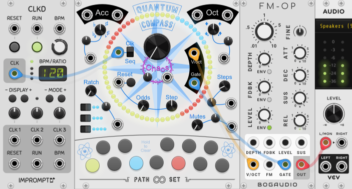
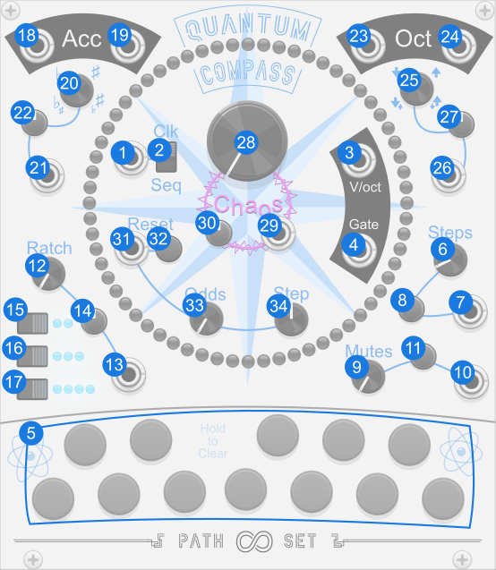
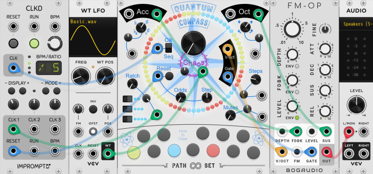

# Quantum Compass

Quantum Compass is a sequencer where instead of controlling each step, you instead turn on certain notes and it decides when to play each note.

## Quick Start

1. Connect an external clock to the `Clock or Position` input.
2. Select two or more notes from the keyboard buttons at the bottom of the module.
3. You will see the central ring of LEDs light up showing you sequence generated. 
4. Connect a voice to the `1V/octave` and `Main Gate` outputs.
5. Add more notes or **hold down a note to remove it**.

[Download Quick Start](../examples/QuantumCompass/QuantumCompass_QuickStart.vcvs?raw=true)

## Panel

1. **Flat Gate output** - High when note is flat.
2. **Sharp Gate output** - Hight when note is sharp.
3. **-1 Octave output** - High when note is one octave down.
4. **+1 Octave output** - High when note is one octave up.
5. **Accidentals Attenuverter** - Modifies CV for Accidentals knob.
6. **Accidentals** - Controls how many notes in the sequence are flat or sharp.
7. **Octave Shift** - Controls how many notes in the sequence are an octave up or down.
8. **Octave Shift Attenuverter** - Modifies CV for Octave Shift knob.
9. **Accidentals CV** - Modulates Accidentals knob.
10. **Clock or Position Input** - Clock Input or Sequence Position depending on the Position Control Switch.
11. **Position Control switch** - Controls if sequence is driven by a clock or a position control.
12. **Chaos** - Adds randomness to accidentals, octave shifts, ratchets and mutes.
13. **1V/Octave** - Note output.
14. **Octave Shift CV** - Modulates Octave Shift knob.
15. **Ratchet** - Controls how many beats in the sequence have play multiple notes.
16. **Reset Trigger** - Resets the position of the sequencer.
17. **Reset Button** - Resets the position of the sequencer.
18. **Chaos Attenuverter** - Modifies CV for Chaos Knob
19. **Chaos CV** - Modulates the Chaos Knob
20.  **Main Gate** - Main Gate output.
21. **Max Step Count** - Controls the number of steps in the sequence.
22. **Half Notes** - Toggles if Ratcheted notes can be half notes.
23. **Ratchet Attenuverter** - Modulates the Ratchet knob.
24. **Reset Odds** - Chance sequence will automatically reset at certain steps.
25. **Reset Step** - Controls which steps the sequence might automatically reset at.
26. **Steps Attenuverter** - Modifies CV for Max Step Count knob
27.  **Steps CV** - Modulates CV for Max Step Count knob
28. **Third Notes** - Toggles if Ratcheted notes can be triplets.
29. **Ratchet CV** - Modifies CV for Ratchet knob.
26. **Mutes** - Controls how many notes in the sequence are silent.
27. **Mutes Attenuverter** - Modifies CV for Mutes knob.
28. **Mutes CV** - Modulates the Mutes knob.
30. **Quarter Notes** - Toggles if Ratcheted notes can be quarter notes.
32. **Keyboard** - Enter Notes. Hold to Remove. 

## Features

### Keyboard 

Unlike normal sequencers the Quantum Compass only takes suggestions on which notes to play. Use 12 `Note` buttons along the bottom to enter which notes you want played. Hold a button down to remove that note.

### Steps 

The `Max Steps Count`, `Steps Attenuveter` and `Steps CV` all control how many steps are in the sequence. Anywhere between 1 and 64 steps are supported. Increasing or decreasing the step count does not change the underlying pattern of notes, it only truncates it.

### Ratchets

Turning up the `Ratchet` knob adds ratcheting to some steps in the sequence. Ratcheted steps can play 2, 3 or 4 times in a single clock cycle. The switches bellow the ratchet know control which of these options are available.  Ratchet also has an attenuveter and CV input. Note that ratcheting pulls from the next 3 notes in the sequence creating more melodic interest. Note that with the `Chaos` knob set to 0 the ratcheting effect is consistent each time the pattern repeats.

### Mutes

Turning up the `Mutes` knob adds silence to some steps in the sequence. The `Mutes` knob also has a attenuverter and CV input. 

### (Auto) Reset

Inside the compass are a `Reset` button and `Reset Trigger` input. Either of these return the sequencer to the start. There are also an `Reset Odds` knob. Turning this up creates a chance that the sequencer will auto reset part way through its sequence. When turning this knob the compass will show a green light on the first step in the sequence and red lights where it has a chance to reset. The `Reset Step` knob controls which steps in the sequence have chance to reset.

### Accidentals & Octaves

The upper left and upper right of the compass have controls and outputs for Accidentals (Flats and Sharps) and Octave Shifts (up or down one octave). These two sections work very similarly. The main `Accidental` or `Octave Shift` knobs can be turned left or right to add steps to the sequence that will have their corresponding effect. As you turn the knob the compass will show you which steps have which effects. If you turn the knobs far in either direction you will get both types of events (Flats and sharps or up and down shifts). Both knobs also have attenuverters and CV inputs. All four events also have output gates at the top. These gates are high the whole clock cycle that they are in effect.

### Chaos

After you've got a fun sequence dialed in you can use the central `Chaos` knob on the Quantum Compass add some randomness to break up the monotony. The compass display will show the effect of the Chaos on whatever other knob you last turned (or you can change the display from the contextual menu). Generally speaking the chaos knob adds more of whatever settings you have dialed in. Though if you turn the chaos knob up too far you'll soon see things become a blur. 

The chaos knob affects Accidentals, Octave Shifts, Ratchets and Mutes. It does not affect the notes entered, the sequence length, or the auto reset.

The `Chaos` knob also has a attenuverter and CV input. Enjoy :)

### Sequence Mode

If all the above wasn't enough, the Quantum Compass has one more twist. Next to the clock input is a switch labeled `Clk` and `Seq` labeled `Position Control`. In the default clock position the clock input expects a trigger/gate and advanced a sequence every time a trigger/gate is received. In the sequence mode that input expects a control voltage. That control voltage directly selects which step the Quantum Compass is playing. When the value changes enough to select a new position a `Gate` is generated. Hook this up to an LFO to create your own or a sample and hold to get even more variation out of the Quantum Compass.

## Misc

### Contextual Menu

**Compass Display Mode** - Control what information is displayed on the ring of LEDs. This is updated automatically when you change a knob related to one of the display modes.

### Bypass
When Quantum Compass is bypassed all outputs stay at 0V.

## Patch Examples

This example patch uses 5 modules. Left to right: [A clock](https://library.vcvrack.com/ImpromptuModular/Clocked-Clkd), an LFO, Quantum Compass, a [Voice](https://library.vcvrack.com/Bogaudio/Bogaudio-FMOp) and Audio Output.

1. The Clock drives Quantum Compass.
2. The clock also modulates Ratching.
3. The LFO modulates Chaos
4. The 1V/Octave and Gate go into the Voice.
5. The Octive Up Gate modulates the sustane on the Voice.
6. The Sharp Gate modulates the feedback

[Download Example 1](../examples/QuantumCompass/QuantumCompass_Example1.vcvs?raw=true)